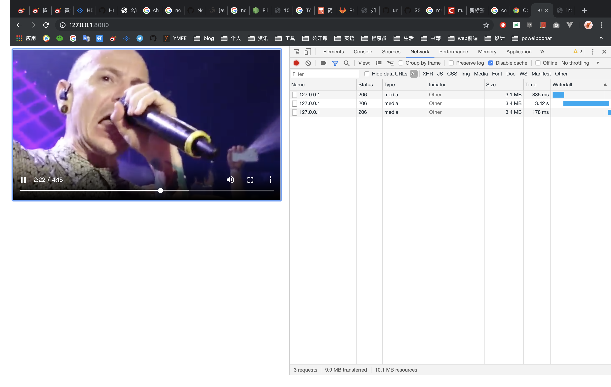
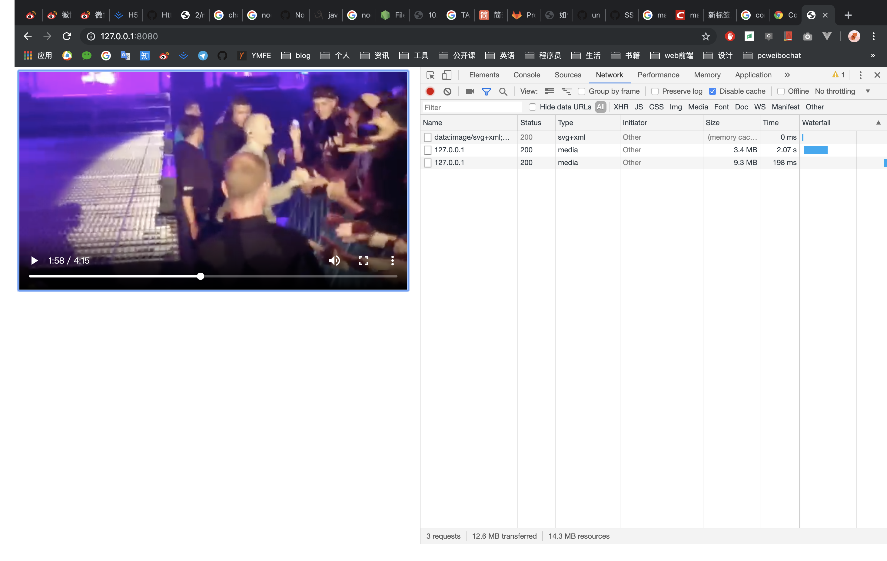
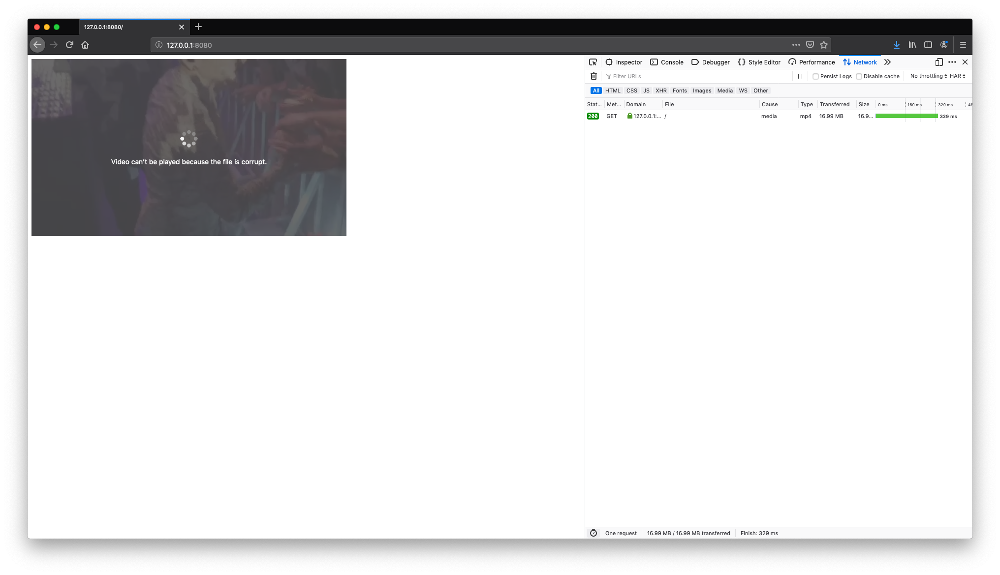
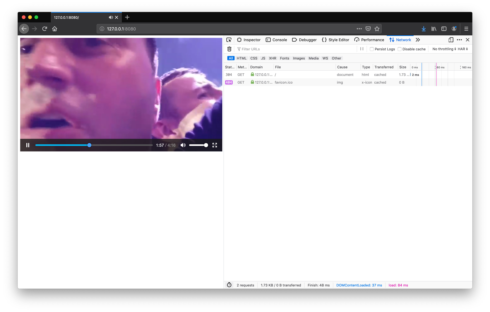

# videotest
**环境 Node v12.6.0**

查看效果请打开 http://104.248.150.21:8888/ 美国服务器请使用 ss

命令行运行 `node server206` 返回 206  

命令行运行 `node server200` 将返回状态码 200

命令行运行 `node server` 运行 index.html

index.html 查看视频 

### chrome

会发现返回 206 的可以随意拉动进度条，并自动加载后续视频内容

而 200 的进度条只能加载小部分且不能随意拉动至未加载部分, 将会暂停，用户再次点击将回到开头，且不再加载

### firefox

200

206

